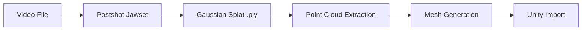

# Video to Unity Model - Quick Pipeline

A minimal data pipeline for converting video footage into a usable 3D model in Unity using Postshot (Jawset).

## Pipeline Overview



**Estimated Time**: 30-60 minutes for a simple object (excluding capture)

---

## Stage 1: Video Capture

### What You Need
- Smartphone or camera
- Good lighting conditions
- A stable subject (no movement)

### Recording Guidelines

| Aspect | Recommendation |
|--------|----------------|
| **Duration** | 30-90 seconds |
| **Movement** | Slow, steady orbits around subject |
| **Coverage** | 360 degree coverage if possible |
| **Distance** | Consistent distance from subject |
| **Lighting** | Even, diffuse lighting (avoid harsh shadows) |
| **Resolution** | 1080p minimum, 4K preferred |
| **Frame Rate** | 30fps is fine |

### Capture Pattern

```
        Top
          |
    ------+------
   /      |      \
  /       |       \
 Left----OBJECT----Right
  \       |       /
   \      |      /
    ------+------
          |
       Bottom

Orbit around the object at multiple heights if possible:
- Eye level orbit
- Above (45 degrees down)
- Below (if accessible)
```

### Output
- Video file (MP4, MOV, etc.)
- Store in an organized folder

---

## Stage 2: Postshot (Jawset) - Gaussian Splatting

### Input
- Video file from Stage 1

### Process

1. **Open Postshot**
2. **Create New Project**
3. **Import Video**
   - Postshot will extract frames automatically
   - It handles camera pose estimation internally
4. **Run Gaussian Splatting**
   - Wait for processing (can take 10-30+ minutes depending on video length and GPU)
5. **Preview and Adjust**
   - Check the splat quality in the viewer
   - Adjust parameters if needed (quality, number of gaussians)
6. **Export as PLY**
   - File > Export > PLY format
   - Save to your working directory

### Postshot Settings (Suggested Starting Point)

| Setting | Value | Notes |
|---------|-------|-------|
| **Quality** | Medium/High | Higher = more detail, longer processing |
| **Gaussian Count** | Default or Auto | More gaussians = more detail |
| **Training Iterations** | 7000-30000 | Higher = better quality, longer time |

### Output
- `model.ply` - Gaussian splat file containing:
  - 3D positions (x, y, z)
  - Colors (as Spherical Harmonics)
  - Opacity values
  - Scale/rotation data

---

## Stage 3: Point Cloud Extraction

### Purpose
Convert the Gaussian Splat PLY into a simple point cloud that mesh reconstruction tools can understand.

### Option A: Python Script (Recommended)

Create `splat_to_pointcloud.py`:

```python
import numpy as np
from plyfile import PlyData, PlyElement
import sys

def sigmoid(x):
    return 1 / (1 + np.exp(-x))

def sh_to_rgb(sh_dc):
    """Convert SH DC component to RGB (simplified)"""
    # SH DC component needs sigmoid activation and scaling
    return np.clip(sigmoid(sh_dc) * 255, 0, 255).astype(np.uint8)

def splat_to_pointcloud(input_path, output_path, opacity_threshold=0.5):
    """
    Extract point cloud from Gaussian Splat PLY file.
    
    Args:
        input_path: Path to input .ply splat file
        output_path: Path to output .ply point cloud file
        opacity_threshold: Minimum opacity to include point (0-1)
    """
    print(f"Reading splat from: {input_path}")
    plydata = PlyData.read(input_path)
    vertex = plydata['vertex']
    
    print(f"Total gaussians: {len(vertex)}")
    
    # Extract positions
    x = np.array(vertex['x'])
    y = np.array(vertex['y'])
    z = np.array(vertex['z'])
    
    # Extract opacity and filter
    if 'opacity' in vertex.data.dtype.names:
        opacity = sigmoid(np.array(vertex['opacity']))
        mask = opacity > opacity_threshold
        print(f"Points after opacity filter ({opacity_threshold}): {np.sum(mask)}")
    else:
        mask = np.ones(len(x), dtype=bool)
    
    # Extract colors from SH DC coefficients
    # Standard naming convention in 3DGS PLY files
    try:
        r = sh_to_rgb(np.array(vertex['f_dc_0']))
        g = sh_to_rgb(np.array(vertex['f_dc_1']))
        b = sh_to_rgb(np.array(vertex['f_dc_2']))
    except ValueError:
        # Alternative naming
        try:
            r = sh_to_rgb(np.array(vertex['red']))
            g = sh_to_rgb(np.array(vertex['green']))
            b = sh_to_rgb(np.array(vertex['blue']))
        except ValueError:
            print("Warning: Could not find color data, using white")
            r = np.ones(len(x), dtype=np.uint8) * 255
            g = np.ones(len(x), dtype=np.uint8) * 255
            b = np.ones(len(x), dtype=np.uint8) * 255
    
    # Apply mask
    x, y, z = x[mask], y[mask], z[mask]
    r, g, b = r[mask], g[mask], b[mask]
    
    # Create output PLY
    vertices = np.array(
        list(zip(x, y, z, r, g, b)),
        dtype=[
            ('x', 'f4'), ('y', 'f4'), ('z', 'f4'),
            ('red', 'u1'), ('green', 'u1'), ('blue', 'u1')
        ]
    )
    
    el = PlyElement.describe(vertices, 'vertex')
    PlyData([el]).write(output_path)
    print(f"Saved point cloud to: {output_path}")
    print(f"Total points: {len(vertices)}")

if __name__ == "__main__":
    if len(sys.argv) < 3:
        print("Usage: python splat_to_pointcloud.py input.ply output.ply [opacity_threshold]")
        sys.exit(1)
    
    input_file = sys.argv[1]
    output_file = sys.argv[2]
    threshold = float(sys.argv[3]) if len(sys.argv) > 3 else 0.5
    
    splat_to_pointcloud(input_file, output_file, threshold)
```

**Requirements:**
```
pip install numpy plyfile
```

**Usage:**
```bash
python splat_to_pointcloud.py model.ply pointcloud.ply 0.3
```

### Option B: SuperSplat (Web Tool)

1. Go to https://playcanvas.com/supersplat/editor
2. Load your .ply file
3. Export as point cloud PLY

### Output
- `pointcloud.ply` - Standard point cloud file with XYZ + RGB

---

## Stage 4: Mesh Generation

### Tool: MeshLab (Free)

Download: https://www.meshlab.net/

### Process

1. **Import Point Cloud**
   - File > Import Mesh > select `pointcloud.ply`

2. **Compute Normals** (Required for Poisson)
   - Filters > Normals, Curvatures and Orientation > Compute Normals for Point Sets
   - Settings:
     - Neighbor num: 10-20
     - Smooth iteration: 2
   - Click Apply

3. **Poisson Surface Reconstruction**
   - Filters > Remeshing, Simplification and Reconstruction > Surface Reconstruction: Screened Poisson
   - Settings:
     - Reconstruction Depth: 8-10 (higher = more detail, more polygons)
     - Adaptive Octree Depth: 5
     - Conjugate Gradients depth: 0
   - Click Apply

4. **Clean Up Mesh**
   - Delete the original point cloud layer (select in layer panel, delete)
   - Filters > Cleaning and Repairing > Remove Isolated Pieces (wrt Diameter)
     - Set max diameter to remove small floating pieces
   - Filters > Cleaning and Repairing > Remove Duplicate Vertices
   - Filters > Cleaning and Repairing > Remove Zero Area Faces

5. **Transfer Vertex Colors** (Optional but recommended)
   - If colors didn't transfer, you may need to:
   - Filters > Sampling > Vertex Attribute Transfer
   - Transfer color from point cloud to mesh

6. **Simplify if Needed**
   - Filters > Remeshing, Simplification and Reconstruction > Simplification: Quadric Edge Collapse Decimation
   - Target number of faces: set based on Unity performance needs
     - Mobile: 10,000 - 50,000 faces
     - Desktop: 50,000 - 500,000 faces

7. **Export**
   - File > Export Mesh As
   - Choose format: **OBJ** or **FBX**
   - Enable: Vert > Color, Vert > Normal

### MeshLab Quick Settings Reference

| Setting | Low Quality | Medium Quality | High Quality |
|---------|-------------|----------------|--------------|
| Poisson Depth | 6-7 | 8-9 | 10-11 |
| Target Faces | 10K | 50K | 200K+ |
| Normal Neighbors | 10 | 15 | 20 |

### Output
- `mesh.obj` (+ `mesh.mtl`) or `mesh.fbx`

---

## Stage 5: Quick Mesh Cleanup (Optional)

If you need UV coordinates for texturing, use Blender:

### Blender Quick UV Unwrap

1. **Import mesh** - File > Import > OBJ/FBX
2. **Select mesh** in object mode
3. **Enter Edit Mode** (Tab key)
4. **Select all** (A key)
5. **UV Unwrap** - Press U > Smart UV Project
   - Angle Limit: 66
   - Island Margin: 0.02
6. **Bake Vertex Colors to Texture** (if needed)
   - Create new image in UV Editor
   - Set up bake settings (Bake Type: Diffuse, uncheck Direct/Indirect)
   - Bake
7. **Export** - File > Export > FBX
   - Enable: Selected Objects
   - Scale: 1.0
   - Apply Transform: checked

For the roughest draft, you can skip Blender entirely and import vertex-colored OBJ directly into Unity.

---

## Stage 6: Unity Import

### Option A: PLY Import with Custom Importer (Recommended)

**Why PLY?** OBJ format doesn't properly support vertex colors. PLY format does, and our custom importer handles it correctly.

#### Setup (One Time)

1. Copy the `unity/PlyImporter` folder from this repository into your Unity project:
   ```
   YourUnityProject/
     Assets/
       PlyImporter/
         PlyImporter.cs
         Editor/
           PlyImporterEditor.cs
         Shaders/
           VertexColor.shader
           VertexColorUnlit.shader
           VertexColorURP.shader
   ```

2. Unity will compile the scripts automatically.

#### Import Process

1. **Export your mesh as PLY** (not OBJ):
   ```bash
   python run_pipeline.py input.ply output.ply
   ```

2. **Drag and drop** the `.ply` file into Unity's Project window
   - The importer automatically creates a mesh with vertex colors
   - A vertex color material is assigned automatically
   - A prefab is created ready to use

3. **Drag the prefab into your Scene**

#### Import Settings

Click on the imported PLY asset to adjust:

| Setting | Description |
|---------|-------------|
| Swap YZ | Toggle if model appears rotated (coordinate system conversion) |
| Scale | Adjust mesh scale (default: 1) |
| Recalculate Normals | Force Unity to recalculate normals |

### Option B: OBJ Import (Vertex Colors May Not Work)

If you must use OBJ format:

1. **Drag and drop** the `.obj` file into Unity's Project window
2. **Configure Import Settings** (click on imported model):

| Setting | Value |
|---------|-------|
| Scale Factor | 1 (adjust if model is wrong size) |
| Convert Units | On |
| Import Normals | Import or Calculate |
| Import Materials | On |

3. **Drag model into Scene**

**Note:** OBJ format has no standard vertex color support. The mesh will likely appear white unless you bake colors to a texture.

### Vertex Color Shaders

The PLY importer includes these shaders:

| Shader | Use Case |
|--------|----------|
| `Custom/VertexColor` | Built-in RP with basic lighting |
| `Custom/VertexColorUnlit` | No lighting, raw vertex colors |
| `Custom/VertexColorURP` | Universal Render Pipeline |

To manually assign:
1. Select your mesh in the scene
2. In the Inspector, find the Material
3. Change the shader to one of the above

### Quick Validation Checklist

- [ ] Model appears in scene at reasonable scale
- [ ] Model is not inside-out (normals correct)
- [ ] Vertex colors display correctly (not white!)
- [ ] Model is at origin or expected position
- [ ] No obvious mesh artifacts

---

## Complete Workflow Summary

```
1. CAPTURE
   Video of object (30-90 sec, 360 orbit)
            |
            v
2. POSTSHOT
   Import video > Process > Export PLY
            |
            v
3. EXTRACT POINTS
   Run: python splat_to_pointcloud.py model.ply points.ply
            |
            v
4. GENERATE MESH
   MeshLab: Import > Compute Normals > Poisson > Clean > Export OBJ
            |
            v
5. UNITY
   Import OBJ > Apply Vertex Color Material > Done
```

---

## Troubleshooting

### Common Issues

| Problem | Cause | Solution |
|---------|-------|----------|
| Empty/no mesh output | Too few points | Lower opacity threshold in extraction |
| Mesh has holes | Sparse point coverage | Increase Poisson depth, or get better video |
| Mesh is blobby | Not enough detail | Higher Poisson depth, more gaussians in Postshot |
| No colors in Unity | Vertex colors not exporting | Ensure color export in MeshLab, use vertex color shader |
| Wrong scale in Unity | Unit mismatch | Adjust scale factor in import settings |
| Model inside-out | Flipped normals | Flip normals in MeshLab or Blender |

### Quality Tips

1. **Better video = better results**
   - More coverage angles
   - Consistent lighting
   - Sharp focus
   - Stable movement

2. **Adjust opacity threshold** in point extraction
   - Lower (0.1-0.3) = more points, more noise
   - Higher (0.5-0.7) = fewer points, cleaner

3. **Poisson depth trade-off**
   - Higher depth = more detail but more artifacts and polygons
   - Start at 8, go up if needed

---

## File Structure Example

```
project/
    video/
        capture_001.mp4
    splats/
        model.ply           (from Postshot)
    pointclouds/
        points.ply          (from extraction script)
    meshes/
        mesh.obj            (from MeshLab)
        mesh.mtl
    unity_project/
        Assets/
            Models/
                mesh.obj
            Materials/
                VertexColor.mat
```

---

## Dependencies Summary

| Tool | Purpose | Cost | Download |
|------|---------|------|----------|
| **Postshot (Jawset)** | Gaussian splatting | Paid (owned) | jawset.com |
| **Python 3.x** | Script execution | Free | python.org |
| **MeshLab** | Mesh generation | Free | meshlab.net |
| **Unity** | Final integration | Free tier | unity.com |

**Python packages:**
```
pip install numpy plyfile
```

---

## Next Steps After Basic Pipeline Works

1. Experiment with different Postshot quality settings
2. Try different Poisson reconstruction depths
3. Add proper UV unwrapping in Blender for texture baking
4. Set up LOD (Level of Detail) in Unity for performance
5. Add colliders for physics interaction
6. Automate the pipeline with batch scripts
